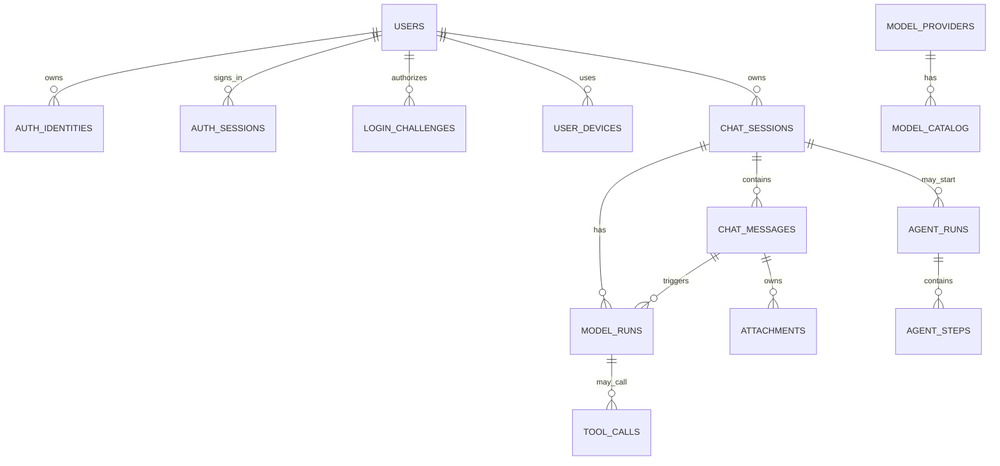

# Database Design

Muse 第一阶段以 AI Chat 为核心，数据库先服务于三类能力：

1. 动态切换模型
2. session 级别管理
3. 历史对话查看

后续会逐步扩展到 Agent、工具调用、本地操作和 Computer Use，因此表设计需要在不增加第一阶段复杂度的前提下，保留可演进空间。

## 1. 技术选择

第一阶段推荐：

- Database: SQLite
- ORM: Drizzle ORM
- ID: UUID string
- Time: ISO datetime string
- JSON: SQLite `TEXT` 存储 JSON，由 Zod/Drizzle schema 约束

选择 SQLite 的原因：

- 适合桌面端本地优先产品。
- session/message 历史读写简单、稳定。
- 后续如果做云同步，可以迁移到 PostgreSQL，表结构迁移成本较低。

## 2. MVP 表清单

第一阶段必须实现：

```txt
users                 App 用户
auth_identities       飞书 / 钉钉 / 微信 / 支付宝等第三方登录身份
auth_sessions         登录态 / refresh token 会话
login_challenges      扫码登录中间态（服务端中转 + 客户端轮询）
user_devices          用户设备
model_providers       模型厂商，例如 openai / deepseek / glm
model_catalog         可用模型目录
chat_sessions         会话 session
chat_messages         session 内消息
model_runs            每次模型调用记录
attachments           附件元数据
```

第二阶段 Agent 再实现：

```txt
tool_calls            工具调用记录
agent_runs            Agent 执行记录
agent_steps           Agent 执行步骤
```

## 3. 表关系



## 4. Core Tables

### 4.1 users

用户主表。桌面 App 第一阶段可以支持本地匿名用户，后续接微信、飞书、钉钉登录时把第三方身份绑定到同一个 `user_id`。

```sql
CREATE TABLE users (
  id TEXT PRIMARY KEY,
  display_name TEXT,
  avatar_url TEXT,
  email TEXT,
  phone TEXT,
  status TEXT NOT NULL DEFAULT 'active',
  locale TEXT,
  timezone TEXT,
  metadata TEXT NOT NULL DEFAULT '{}',
  created_at TEXT NOT NULL,
  updated_at TEXT NOT NULL,
  last_login_at TEXT
);

CREATE INDEX idx_users_status ON users(status);
CREATE INDEX idx_users_email ON users(email);
CREATE INDEX idx_users_phone ON users(phone);
```

字段说明：

```txt
display_name   用户展示名
avatar_url     头像
email          邮箱，可为空
phone          手机号，可为空
status         active / disabled / deleted
metadata       用户扩展信息
last_login_at  最近一次登录时间
```

### 4.2 auth_identities

第三方登录身份表。一个用户可以绑定多个身份，例如微信 + 飞书 + 钉钉。

```sql
CREATE TABLE auth_identities (
  id TEXT PRIMARY KEY,
  user_id TEXT NOT NULL REFERENCES users(id) ON DELETE CASCADE,
  identity_key TEXT NOT NULL UNIQUE,
  provider TEXT NOT NULL,
  provider_user_id TEXT NOT NULL,
  provider_union_id TEXT,
  provider_tenant_id TEXT NOT NULL DEFAULT '',
  provider_open_id TEXT,
  display_name TEXT,
  avatar_url TEXT,
  access_token_encrypted TEXT,
  refresh_token_encrypted TEXT,
  token_expires_at TEXT,
  raw_profile TEXT NOT NULL DEFAULT '{}',
  created_at TEXT NOT NULL,
  updated_at TEXT NOT NULL,
  last_used_at TEXT
);

CREATE INDEX idx_auth_identities_user ON auth_identities(user_id);
CREATE INDEX idx_auth_identities_provider ON auth_identities(provider);
CREATE INDEX idx_auth_identities_tenant
  ON auth_identities(provider, provider_tenant_id);
```

字段说明：

```txt
identity_key             业务层生成的唯一身份键，unionId 优先，例如 wechat::unionid 或 feishu:tenant_key:union_id
provider                 feishu / dingtalk / wechat / alipay
provider_user_id         第三方平台用户唯一 ID
provider_union_id        微信 unionid、飞书 union_id、钉钉 unionId 等
provider_tenant_id       飞书 tenant_key、钉钉 corp_id 等企业/租户 ID
provider_open_id         平台 open_id，可能和 union_id 同时存在
access_token_encrypted   加密后的 access token
refresh_token_encrypted  加密后的 refresh token
raw_profile              第三方用户资料原始 JSON
```

注意：

- access token / refresh token 必须加密后再落库。
- 如果只需要登录，不需要调用第三方 API，可以不保存 token，只保存身份映射。
- 飞书、钉钉都有企业/租户语义，因此 `provider_tenant_id` 要保留。
- `identity_key` 采用 unionId 优先规则：同一 provider 的网站应用与移动应用往往是不同 AppID，`open_id` 各不相同，用 union_id 作为锚点才能保证同一个人跨端跨应用识别一致。支付宝无 unionId，退回 `user_id`。构造规则见 `auth-implementation-plan.md` 第 3 节。

### 4.3 auth_sessions

App 登录态表。用于管理桌面端、移动端、小程序端的登录状态。

```sql
CREATE TABLE auth_sessions (
  id TEXT PRIMARY KEY,
  user_id TEXT NOT NULL REFERENCES users(id) ON DELETE CASCADE,
  device_id TEXT REFERENCES user_devices(id),
  refresh_token_hash TEXT NOT NULL,
  status TEXT NOT NULL DEFAULT 'active',
  ip_address TEXT,
  user_agent TEXT,
  metadata TEXT NOT NULL DEFAULT '{}',
  created_at TEXT NOT NULL,
  updated_at TEXT NOT NULL,
  expires_at TEXT NOT NULL,
  revoked_at TEXT
);

CREATE INDEX idx_auth_sessions_user ON auth_sessions(user_id);
CREATE INDEX idx_auth_sessions_device ON auth_sessions(device_id);
CREATE INDEX idx_auth_sessions_status ON auth_sessions(status);
CREATE INDEX idx_auth_sessions_expires_at ON auth_sessions(expires_at);
```

字段说明：

```txt
refresh_token_hash  refresh token hash，不存明文
status              active / revoked / expired
device_id           关联 user_devices，可为空
revoked_at          主动退出登录或风控失效时间
```

### 4.4 login_challenges

扫码登录中间态表。桌面端与移动端扫码登录无法在客户端直接接收 OAuth 回调（回调只落到服务端），需要"服务端中转 + 客户端轮询"。Web 端走标准重定向，不使用此表。

```sql
CREATE TABLE login_challenges (
  state TEXT PRIMARY KEY,
  provider TEXT NOT NULL,
  client_platform TEXT NOT NULL,
  code_verifier TEXT,
  status TEXT NOT NULL DEFAULT 'pending',
  user_id TEXT REFERENCES users(id) ON DELETE CASCADE,
  session_token_hash TEXT,
  error_code TEXT,
  metadata TEXT NOT NULL DEFAULT '{}',
  created_at TEXT NOT NULL,
  expires_at TEXT NOT NULL,
  consumed_at TEXT
);

CREATE INDEX idx_login_challenges_status ON login_challenges(status);
CREATE INDEX idx_login_challenges_expires_at ON login_challenges(expires_at);
```

字段说明：

```txt
state                一次扫码会话的随机 id，兼作 OAuth state 防 CSRF
provider             feishu / dingtalk / wechat / alipay
client_platform      macos / windows / ios / android（web 走重定向，不用此表）
code_verifier        PKCE 场景（飞书）本地生成的 verifier，回调换 token 时使用
status               pending / authorized / consumed / expired / failed
user_id              授权成功后回填
session_token_hash   授权成功后挂上；客户端轮询取走 token 后置 consumed
error_code           换 token 或身份获取失败时的错误码
expires_at           通常 5~10 分钟，对齐各家授权码有效期（飞书 5 分钟 / 微信 10 分钟）
consumed_at          客户端取走 token 的时间
```

状态流转：

```txt
pending    --用户扫码授权、服务端回调换取身份成功-->  authorized
authorized --客户端轮询取走 token-->                 consumed
pending    --超过 expires_at-->                       expired
任意        --换 token 或身份获取失败-->              failed
```

详细时序与 provider 适配层见 `auth-implementation-plan.md` 第 6、7 节。

### 4.5 user_devices

用户设备表。桌面 App 后续会涉及本机权限、Computer Use、本地文件能力，设备维度很重要。

```sql
CREATE TABLE user_devices (
  id TEXT PRIMARY KEY,
  user_id TEXT REFERENCES users(id) ON DELETE CASCADE,
  device_name TEXT,
  platform TEXT NOT NULL,
  app_version TEXT,
  installation_id TEXT NOT NULL,
  trusted INTEGER NOT NULL DEFAULT 0,
  metadata TEXT NOT NULL DEFAULT '{}',
  created_at TEXT NOT NULL,
  updated_at TEXT NOT NULL,
  last_seen_at TEXT,
  UNIQUE(installation_id)
);

CREATE INDEX idx_user_devices_user ON user_devices(user_id);
CREATE INDEX idx_user_devices_platform ON user_devices(platform);
```

字段说明：

```txt
platform         macos / windows / ios / android / miniapp
installation_id  单次安装生成的本地唯一 ID
trusted          是否可信设备
metadata         系统版本、机器名、权限状态等
```

### 4.6 model_providers

模型厂商表。用于管理 OpenAI、DeepSeek、GLM 等 provider。

```sql
CREATE TABLE model_providers (
  id TEXT PRIMARY KEY,
  name TEXT NOT NULL,
  display_name TEXT NOT NULL,
  base_url TEXT,
  auth_type TEXT NOT NULL DEFAULT 'api_key',
  enabled INTEGER NOT NULL DEFAULT 1,
  metadata TEXT NOT NULL DEFAULT '{}',
  created_at TEXT NOT NULL,
  updated_at TEXT NOT NULL
);
```

字段说明：

```txt
id            openai / deepseek / glm
name          程序内部 provider 名称
display_name  UI 展示名称
base_url      OpenAI-compatible endpoint
auth_type     api_key / oauth / local
enabled       是否启用
metadata      provider 扩展配置
```

### 4.7 model_catalog

模型目录表。用于动态展示和选择模型。

```sql
CREATE TABLE model_catalog (
  id TEXT PRIMARY KEY,
  provider_id TEXT NOT NULL REFERENCES model_providers(id),
  name TEXT NOT NULL,
  display_name TEXT NOT NULL,
  context_window INTEGER,
  supports_streaming INTEGER NOT NULL DEFAULT 1,
  supports_tools INTEGER NOT NULL DEFAULT 0,
  supports_vision INTEGER NOT NULL DEFAULT 0,
  supports_json_mode INTEGER NOT NULL DEFAULT 0,
  enabled INTEGER NOT NULL DEFAULT 1,
  metadata TEXT NOT NULL DEFAULT '{}',
  created_at TEXT NOT NULL,
  updated_at TEXT NOT NULL,
  UNIQUE(provider_id, name)
);

CREATE INDEX idx_model_catalog_provider ON model_catalog(provider_id);
CREATE INDEX idx_model_catalog_enabled ON model_catalog(enabled);
```

字段说明：

```txt
provider_id          关联模型厂商
name                 API 调用时使用的模型名
display_name         UI 展示名
context_window       上下文窗口大小
supports_streaming   是否支持流式输出
supports_tools       是否支持 tool calling
supports_vision      是否支持图片输入
supports_json_mode   是否支持 JSON mode
```

### 4.8 chat_sessions

会话表。一个 session 对应一次连续上下文对话。

```sql
CREATE TABLE chat_sessions (
  id TEXT PRIMARY KEY,
  user_id TEXT REFERENCES users(id) ON DELETE CASCADE,
  title TEXT NOT NULL,
  summary TEXT,
  default_provider_id TEXT REFERENCES model_providers(id),
  default_model_id TEXT REFERENCES model_catalog(id),
  status TEXT NOT NULL DEFAULT 'active',
  pinned INTEGER NOT NULL DEFAULT 0,
  archived INTEGER NOT NULL DEFAULT 0,
  metadata TEXT NOT NULL DEFAULT '{}',
  created_at TEXT NOT NULL,
  updated_at TEXT NOT NULL,
  last_message_at TEXT
);

CREATE INDEX idx_chat_sessions_user_updated_at
  ON chat_sessions(user_id, updated_at DESC);

CREATE INDEX idx_chat_sessions_updated_at ON chat_sessions(updated_at DESC);
CREATE INDEX idx_chat_sessions_last_message_at ON chat_sessions(last_message_at DESC);
CREATE INDEX idx_chat_sessions_archived ON chat_sessions(archived);
CREATE INDEX idx_chat_sessions_pinned ON chat_sessions(pinned);
```

字段说明：

```txt
user_id               session 归属用户；本地匿名模式可为空或指向本地用户
title                 会话标题，可由第一条消息或模型自动生成
summary               session 摘要，后续用于长上下文压缩
default_provider_id   当前 session 默认 provider
default_model_id      当前 session 默认 model
status                active / generating / failed
pinned                是否置顶
archived              是否归档
metadata              客户端布局、标签、来源等扩展信息
last_message_at       历史会话列表排序使用
```

### 4.9 chat_messages

消息表。保存用户消息、助手回复、系统消息和后续工具消息。

```sql
CREATE TABLE chat_messages (
  id TEXT PRIMARY KEY,
  session_id TEXT NOT NULL REFERENCES chat_sessions(id) ON DELETE CASCADE,
  parent_message_id TEXT REFERENCES chat_messages(id),
  role TEXT NOT NULL,
  parts TEXT NOT NULL,
  plain_text TEXT,
  status TEXT NOT NULL DEFAULT 'completed',
  token_count INTEGER,
  metadata TEXT NOT NULL DEFAULT '{}',
  created_at TEXT NOT NULL,
  updated_at TEXT NOT NULL
);

CREATE INDEX idx_chat_messages_session_created_at
  ON chat_messages(session_id, created_at ASC);

CREATE INDEX idx_chat_messages_role ON chat_messages(role);
CREATE INDEX idx_chat_messages_parent ON chat_messages(parent_message_id);
```

字段说明：

```txt
session_id          归属 session
parent_message_id   后续支持分支对话、重新生成
role                system / user / assistant / tool
parts               Vercel AI SDK message parts JSON
plain_text          搜索和列表 preview 使用的纯文本
status              pending / streaming / completed / failed / canceled
token_count         估算或模型返回 token 数
metadata            message 级扩展信息
```

`parts` 示例：

```json
[
  {
    "type": "text",
    "text": "帮我总结一下当前项目的数据库设计"
  }
]
```

### 4.10 model_runs

模型调用表。一次用户请求可能产生一次或多次模型调用。

```sql
CREATE TABLE model_runs (
  id TEXT PRIMARY KEY,
  session_id TEXT NOT NULL REFERENCES chat_sessions(id) ON DELETE CASCADE,
  request_message_id TEXT REFERENCES chat_messages(id),
  response_message_id TEXT REFERENCES chat_messages(id),
  provider_id TEXT REFERENCES model_providers(id),
  model_id TEXT REFERENCES model_catalog(id),
  provider_model_name TEXT NOT NULL,
  status TEXT NOT NULL DEFAULT 'pending',
  stream_id TEXT,
  prompt_tokens INTEGER,
  completion_tokens INTEGER,
  total_tokens INTEGER,
  latency_ms INTEGER,
  error_code TEXT,
  error_message TEXT,
  request_metadata TEXT NOT NULL DEFAULT '{}',
  response_metadata TEXT NOT NULL DEFAULT '{}',
  created_at TEXT NOT NULL,
  started_at TEXT,
  completed_at TEXT
);

CREATE INDEX idx_model_runs_session_created_at
  ON model_runs(session_id, created_at DESC);

CREATE INDEX idx_model_runs_request_message
  ON model_runs(request_message_id);

CREATE INDEX idx_model_runs_status ON model_runs(status);
```

字段说明：

```txt
request_message_id     用户触发模型调用的消息
response_message_id    模型生成的 assistant 消息
provider_model_name    实际发送给 provider 的模型名
status                 pending / streaming / completed / failed / canceled
stream_id              SSE stream 标识
usage                  prompt/completion/total tokens
latency_ms             性能观测
request_metadata       temperature、max_tokens、top_p 等参数
response_metadata      provider response id、finish reason 等
```

### 4.11 attachments

附件表。第一阶段可以先保存元信息，文件本体放本地文件系统或对象存储。

```sql
CREATE TABLE attachments (
  id TEXT PRIMARY KEY,
  user_id TEXT REFERENCES users(id) ON DELETE CASCADE,
  session_id TEXT REFERENCES chat_sessions(id) ON DELETE CASCADE,
  message_id TEXT REFERENCES chat_messages(id) ON DELETE CASCADE,
  file_name TEXT NOT NULL,
  mime_type TEXT,
  file_size INTEGER,
  storage_type TEXT NOT NULL DEFAULT 'local',
  storage_path TEXT NOT NULL,
  checksum TEXT,
  status TEXT NOT NULL DEFAULT 'ready',
  metadata TEXT NOT NULL DEFAULT '{}',
  created_at TEXT NOT NULL
);

CREATE INDEX idx_attachments_user ON attachments(user_id);
CREATE INDEX idx_attachments_session ON attachments(session_id);
CREATE INDEX idx_attachments_message ON attachments(message_id);
```

字段说明：

```txt
user_id        附件归属用户
storage_type   local / remote / temp
storage_path   本地路径或远端 object key
checksum       去重和完整性校验
status         uploading / ready / failed / deleted
metadata       图片宽高、文档页数、提取文本状态等
```

## 5. Agent Extension Tables

这些表不进入第一阶段 MVP，但建议预留设计。

### 5.1 agent_runs

```sql
CREATE TABLE agent_runs (
  id TEXT PRIMARY KEY,
  session_id TEXT NOT NULL REFERENCES chat_sessions(id) ON DELETE CASCADE,
  trigger_message_id TEXT REFERENCES chat_messages(id),
  status TEXT NOT NULL DEFAULT 'pending',
  goal TEXT,
  result_message_id TEXT REFERENCES chat_messages(id),
  metadata TEXT NOT NULL DEFAULT '{}',
  created_at TEXT NOT NULL,
  started_at TEXT,
  completed_at TEXT
);

CREATE INDEX idx_agent_runs_session_created_at
  ON agent_runs(session_id, created_at DESC);

CREATE INDEX idx_agent_runs_status ON agent_runs(status);
```

### 5.2 agent_steps

```sql
CREATE TABLE agent_steps (
  id TEXT PRIMARY KEY,
  agent_run_id TEXT NOT NULL REFERENCES agent_runs(id) ON DELETE CASCADE,
  step_index INTEGER NOT NULL,
  type TEXT NOT NULL,
  status TEXT NOT NULL DEFAULT 'pending',
  input TEXT NOT NULL DEFAULT '{}',
  output TEXT NOT NULL DEFAULT '{}',
  error_message TEXT,
  created_at TEXT NOT NULL,
  started_at TEXT,
  completed_at TEXT,
  UNIQUE(agent_run_id, step_index)
);

CREATE INDEX idx_agent_steps_run_index
  ON agent_steps(agent_run_id, step_index ASC);
```

### 5.3 tool_calls

```sql
CREATE TABLE tool_calls (
  id TEXT PRIMARY KEY,
  model_run_id TEXT REFERENCES model_runs(id) ON DELETE CASCADE,
  agent_step_id TEXT REFERENCES agent_steps(id) ON DELETE CASCADE,
  tool_name TEXT NOT NULL,
  call_id TEXT,
  status TEXT NOT NULL DEFAULT 'pending',
  input TEXT NOT NULL DEFAULT '{}',
  output TEXT NOT NULL DEFAULT '{}',
  error_message TEXT,
  created_at TEXT NOT NULL,
  started_at TEXT,
  completed_at TEXT
);

CREATE INDEX idx_tool_calls_model_run ON tool_calls(model_run_id);
CREATE INDEX idx_tool_calls_agent_step ON tool_calls(agent_step_id);
CREATE INDEX idx_tool_calls_status ON tool_calls(status);
```

后续 Computer Use 可把截图、鼠标键盘操作、窗口信息等作为 tool call 的 input/output 或附件保存。

## 6. History Search

第一阶段可以先用 `LIKE` 做轻量搜索：

```sql
SELECT *
FROM chat_sessions
WHERE archived = 0
  AND (
    title LIKE '%' || ? || '%'
    OR summary LIKE '%' || ? || '%'
  )
ORDER BY last_message_at DESC;
```

如果历史消息变多，再引入 SQLite FTS5：

```sql
CREATE VIRTUAL TABLE chat_messages_fts USING fts5(
  message_id UNINDEXED,
  session_id UNINDEXED,
  plain_text
);
```

## 7. Recommended MVP Implementation Order

建议按以下顺序实现：

1. `users`
2. `auth_identities`
3. `auth_sessions`
4. `login_challenges`
5. `user_devices`
6. `model_providers`
7. `model_catalog`
8. `chat_sessions`
9. `chat_messages`
10. `model_runs`
11. `attachments`

第一阶段接口对应关系：

```txt
GET    /api/models                    -> model_providers + model_catalog
GET    /api/auth/me                   -> users + auth_identities
POST   /api/auth/{provider}/challenge -> login_challenges
GET    /api/auth/{provider}/callback  -> users + auth_identities + auth_sessions + login_challenges
GET    /api/auth/challenge/status     -> login_challenges
POST   /api/auth/logout               -> auth_sessions
GET    /api/sessions                  -> chat_sessions
POST   /api/sessions                  -> chat_sessions
GET    /api/sessions/:id              -> chat_sessions + chat_messages
POST   /api/chat                      -> chat_messages + model_runs
```

完整 auth 接口清单见 `auth-implementation-plan.md` 第 8 节。

## 8. Notes

- `chat_messages.parts` 对齐 Vercel AI SDK 的 message parts，避免后续 streaming/tool calling 时反复迁移结构。
- `model_runs` 不要和 `chat_messages` 合并。消息是产品对象，run 是一次模型调用对象，二者生命周期不同。
- `chat_sessions.default_model_id` 表示 session 默认模型；`model_runs.model_id` 表示某一次实际调用使用的模型。这样可以支持同一个 session 中途切换模型。
- `users` 和 `auth_identities` 要分开。`users` 是 Muse 内部用户，`auth_identities` 是微信、飞书、钉钉等外部身份映射。
- `chat_sessions.user_id` 是后续多端同步、历史隔离和账号切换的关键字段，即使第一阶段本地匿名使用，也建议创建一个本地用户。
- 第三方 access token / refresh token 不要明文保存。若只是登录，不需要调用第三方 API，可以只保存身份 ID 和 profile。
- 飞书和钉钉要保留租户字段，避免同一个外部用户在不同企业空间下发生身份歧义。
- 第一阶段不做长期记忆，长期记忆后续应单独设计 `memories` 或 `knowledge_items`，不要混在 session message 里。
