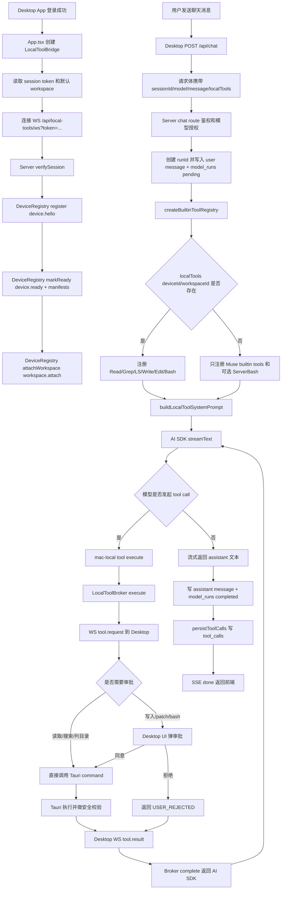
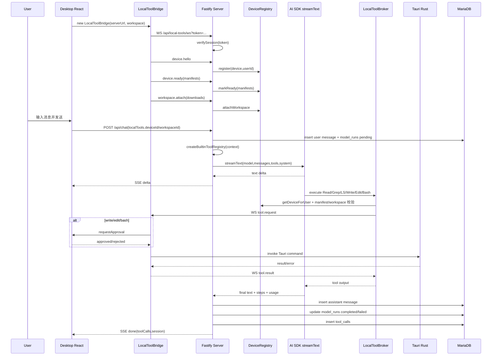

# LocalTools 调用链路

这份文档基于当前代码梳理 Muse 的 LocalTools 链路，覆盖桌面端注册、后端工具注册、模型调用、agent 工具执行、Tauri 本机执行和落库审计。

## 1. 关键模块

| 模块           | 文件                                                                             | 职责                                                                                                    |
| -------------- | -------------------------------------------------------------------------------- | ------------------------------------------------------------------------------------------------------- |
| 共享协议       | `packages/shared/src/schemas/local-tools.ts`                                     | 定义 LocalTool manifest、设备消息、workspace 消息、tool request/result/error 的 Zod schema 与 TS 类型。 |
| WebSocket 安装 | `apps/server/src/server.ts` / `apps/server/src/local-tools/local-tool-socket.ts` | 在 Fastify 底层 HTTP server 上安装 `/api/local-tools/ws` upgrade 入口，并用 session token 鉴权。        |
| 设备注册表     | `apps/server/src/local-tools/device-registry.ts`                                 | 维护 user -> device -> workspace/tool manifest 的内存状态。                                             |
| Broker         | `apps/server/src/local-tools/local-tool-broker.ts`                               | 把 AI SDK tool execute 转成 WebSocket `tool.request`，等待 desktop 返回 `tool.result`。                 |
| Agent 工具注册 | `apps/server/src/agent/tool-registry.ts`                                         | 按请求上下文组合 builtin tools、ServerBash、macOS LocalTools。                                          |
| macOS 工具适配 | `apps/server/src/agent/tools/mac-local.ts`                                       | 暴露给模型的 `Read/Grep/LS/Write/Edit/Bash`，内部映射到 desktop manifest 工具名。                       |
| Chat 模型调用  | `apps/server/src/routes/chat.ts`                                                 | 创建 model run、构造 system prompt/messages/tools、调用 `streamText`、持久化工具调用。                  |
| Desktop Bridge | `apps/desktop/src/local-tools/bridge.ts`                                         | 登录后连接 WebSocket，注册设备、manifest、workspace，执行服务端下发的工具请求。                         |
| Desktop UI     | `apps/desktop/src/App.tsx`                                                       | 初始化 `LocalToolBridge`，聊天请求携带 `localTools.deviceId/workspaceId`，写入/命令类工具弹审批。       |
| Tauri 本机能力 | `apps/desktop/src-tauri/src/lib.rs`                                              | 实际读写文件、搜索、列目录、patch、bash 执行，并实施 workspace/path/command 限制。                      |
| 审计表         | `apps/server/src/db/schema.ts`                                                   | `model_runs` 记录模型调用，`tool_calls` 记录工具调用输入、输出、状态与风险级别。                        |

## 2. 总体流程图



## 3. 注册链路

### 3.1 Desktop 端注册

`ChatApp` 初始化时创建 `LocalToolBridge`，传入：

- `serverUrl`：默认 `http://127.0.0.1:8787`。
- `workspace`：当前默认 workspace 是 `downloads`，根路径 `/Users/bytedance/Downloads`。
- `onStatus`：更新 UI 中的 LocalTools 连接状态。
- `onApproval`：把高风险工具转成 UI 审批弹窗。

`LocalToolBridge.connect()` 的顺序是：

1. 从本地登录态读取 session token。
2. 拼出 `ws://127.0.0.1:8787/api/local-tools/ws?token=<token>`。
3. WebSocket open 后发送 `device.hello`：
   - `deviceId` 来自 localStorage 的稳定 ID。
   - `name = Muse macOS`，`platform = macos`。
4. 发送 `device.ready`，携带 desktop 真实可执行工具的 manifest。
5. 发送 `workspace.attach`，绑定当前 workspace。
6. 状态切到 `ready`。

desktop manifest 和模型可见工具不是同一组名字。desktop manifest 更接近执行层能力：

| Desktop manifest tool      | 风险        | 是否审批 | Tauri command              |
| -------------------------- | ----------- | -------- | -------------------------- |
| `workspace.read_file`      | `read`      | 否       | `read_workspace_file`      |
| `workspace.search_files`   | `read`      | 否       | `search_workspace_files`   |
| `workspace.list_directory` | `read`      | 否       | `list_workspace_directory` |
| `workspace.write_file`     | `write`     | 是       | `write_workspace_file`     |
| `workspace.apply_patch`    | `write`     | 是       | `apply_workspace_patch`    |
| `workspace.run_command`    | `dangerous` | 是       | `run_workspace_command`    |

### 3.2 Server 端注册

`installLocalToolSocket()` 挂在 Fastify 的底层 HTTP server 上，而不是普通 Fastify route。它只处理 `/api/local-tools/ws`：

1. 从 query string 读取 `token`。
2. 调用 `verifySession(token)` 得到 `userId`，失败则 401 并关闭 socket。
3. WebSocket 收到 client message 后用 `localToolClientMessageSchema` 校验。
4. 按消息类型更新 `DeviceRegistry`：
   - `device.hello` -> `register()`，建立 device 与 user 归属。
   - `device.ready` -> `markReady()`，保存 manifest。
   - `workspace.attach` -> `attachWorkspace()`，保存 workspace grant。
   - `workspace.detach` -> `detachWorkspace()`。
   - `tool.result/tool.error` -> `LocalToolBroker.complete()`。
5. socket close 时 unregister device，并让 Broker 将该设备上的 pending request 失败返回。

`GET /api/local-tools/devices` 只读取当前用户的注册快照，供调试或 UI 展示使用；核心模型链路不依赖这个接口。

## 4. 模型调用链路

聊天请求由 Desktop 的 `sendCurrentMessage()` 发起。请求体里除了 `sessionId/model/message`，还会在存在 `localToolSnapshot` 时附带：

```json
{
  "localTools": {
    "deviceId": "<desktop-device-id>",
    "workspaceId": "downloads"
  }
}
```

后端 `POST /api/chat` 的处理顺序：

1. 校验 body 和用户登录态。
2. 查 session，懒创建新 session；校验模型授权，目前只支持 `deepseek` provider。
3. 生成 `runId`，事务写入：
   - 用户消息到 `chat_messages`。
   - 模型调用到 `model_runs`，状态为 `pending`。
4. 调用 `createBuiltinToolRegistry()` 创建 AI SDK tools。
5. 用已注册工具名构造 system prompt：
   - LocalTools 不可用时，提示模型本机工具未连接。
   - LocalTools 可用时，明确提示可以使用 `Read/Grep/LS/Write/Edit/Bash`。
6. 调用 AI SDK `streamText()`：
   - `model`：由 `createDeepSeekProvider()` 创建。
   - `messages`：历史 completed user/assistant 消息 + 当前用户消息。
   - `tools`：本次请求动态注册的工具集合。
   - `stopWhen: stepCountIs(5)`：最多允许多步工具调用。
7. 将 `textStream` 增量转成 SSE `delta` 推给前端。
8. 模型流结束后读取 `result.text/result.steps/result.totalUsage`，持久化 assistant message、model run usage 和 tool calls。

## 5. Agent 使用工具链路

当前代码里的“agent 使用”主要是 Vercel AI SDK 的 tool calling，而不是独立的 Mastra Agent runtime。`createBuiltinToolRegistry()` 会按上下文注册四类工具：

| 工具来源          | 工具名                                                                    | 注册条件                                                      | 执行位置            |
| ----------------- | ------------------------------------------------------------------------- | ------------------------------------------------------------- | ------------------- |
| Muse builtin      | `muse_time_now`                                                           | 总是注册                                                      | Server 进程内       |
| Muse session      | `muse_session_current` / `muse_session_messages` / `muse_search_messages` | 总是注册                                                      | Server 访问 MariaDB |
| Muse model        | `muse_models_available`                                                   | 总是注册                                                      | Server 访问 MariaDB |
| Server local bash | `ServerBash`                                                              | `MUSE_LOCAL_BASH_ENABLED=true`                                | Server 宿主机       |
| macOS LocalTools  | `Read` / `Grep` / `LS` / `Write` / `Edit` / `Bash`                        | chat 请求里有 `deviceId/workspaceId` 且传入 `localToolBroker` | Desktop/Tauri 本机  |

模型可见的 macOS LocalTools 是一层语义封装：

| 模型可见工具 | Broker toolName            | 说明                                                  |
| ------------ | -------------------------- | ----------------------------------------------------- |
| `Read`       | `workspace.read_file`      | 读取 workspace 内文本文件。                           |
| `Grep`       | `workspace.search_files`   | 搜索 workspace 内文本文件。                           |
| `LS`         | `workspace.list_directory` | 列出 workspace 内目录。                               |
| `Write`      | `workspace.write_file`     | 创建或覆盖文件，desktop 审批后执行。                  |
| `Edit`       | `workspace.apply_patch`    | 对单个文本文件应用 unified diff，desktop 审批后执行。 |
| `Bash`       | `workspace.run_command`    | 在 workspace 内执行 bash，desktop 审批后执行。        |

当模型选择某个工具时，AI SDK 调用该工具的 `execute()`：

1. `mac-local.ts` 校验 `localToolBroker/runId/deviceId/workspaceId` 是否存在。
2. 把模型工具名映射成 desktop manifest toolName。
3. 调用 `LocalToolBroker.execute()`。
4. Broker 校验：
   - device 是否属于当前 user。
   - workspace 是否已 attach。
   - device manifest 是否包含目标 toolName。
5. Broker 生成 `requestId`，写入 pending map，向 desktop WebSocket 发送 `tool.request`。
6. Desktop `LocalToolBridge.handleMessage()` 收到请求，执行 `executeTool()`。
7. 执行结果通过 `tool.result` 返回 Broker。
8. Broker resolve promise，AI SDK 把工具结果交回模型进入下一步推理。

## 6. 时序图



## 7. 安全边界与审批

LocalTools 的安全边界分三层：

1. Server 连接层
   - WebSocket 必须携带有效 session token。
   - deviceId 必须绑定到当前 user。
   - tool request 只会发往当前 user 的目标 device。

2. Broker 调度层
   - workspace 必须已经 attach。
   - toolName 必须存在于 desktop 上报的 manifest。
   - 每个 request 有独立 `requestId` 和 timeout，默认 15 秒。
   - device 断开时，该 device 上的 pending request 全部失败返回。

3. Desktop/Tauri 执行层
   - 所有 path 必须 canonicalize 后仍在 workspace root 内。
   - 拒绝 `.env`、`.env.*`、`.ssh`、`Keychains` 等敏感路径。
   - 命令拒绝 `sudo`、`rm -rf`、`git reset --hard`、`git clean -fd`、`chmod`、`chown`、`curl | sh`、`wget | sh`、`.env`、`.ssh`、`Keychains` 等危险模式。
   - 读文件最多 32 KiB，搜索最多 500 文件 / 80 matches，写入和 patch 有大小上限，命令输出会截断。
   - `workspace.write_file`、`workspace.apply_patch`、`workspace.run_command` 必须走 Desktop UI 审批。

## 8. 落库与前端回显

`model_runs` 是一次模型调用的主记录：

- 请求消息、响应消息。
- provider/modelName/aiModelId。
- 状态、错误、token usage、开始和完成时间。

`tool_calls` 是工具调用轨迹：

- `modelRunId/sessionId/userId`。
- AI SDK 的 `toolCallId`。
- `toolName/toolSource/riskLevel/requiresApproval`。
- `inputJson/outputJson/status/errorMessage`。
- `startedAt/completedAt/createdAt`。

当前 `persistToolCalls()` 在模型最终 `steps` 返回后统一落库。成功拿到 tool result 的调用写为 `succeeded`，没有 result 的调用写为 `running`。SSE `done` 会把落库后的 tool call 摘要返回给 Desktop，但当前 UI 主要用于定稿 assistant 消息，尚未完整展示工具调用详情。

## 9. 当前实现边界

- macOS LocalTools 只在 Desktop/Tauri 端真正可执行；Mobile 只能远程借用在线 Desktop 的能力。
- 默认 workspace 仍是代码里硬编码的 `/Users/bytedance/Downloads`，还不是用户可配置、多 workspace 管理形态。
- `ServerBash` 和 macOS `Bash` 是两条不同执行边界：
  - `ServerBash` 在后端宿主机执行，默认关闭，由 `MUSE_LOCAL_BASH_ENABLED` 控制。
  - `Bash` 通过 desktop bridge 在用户 macOS workspace 内执行，需要 UI 审批。
- 当前模型 provider 在 chat route 中只允许 `deepseek`，但工具注册本身与 provider 解耦。
- `tool_calls` 的错误状态目前依赖 AI SDK steps 的结果汇总，尚未在 Broker 层实时落库 pending/succeeded/failed。
